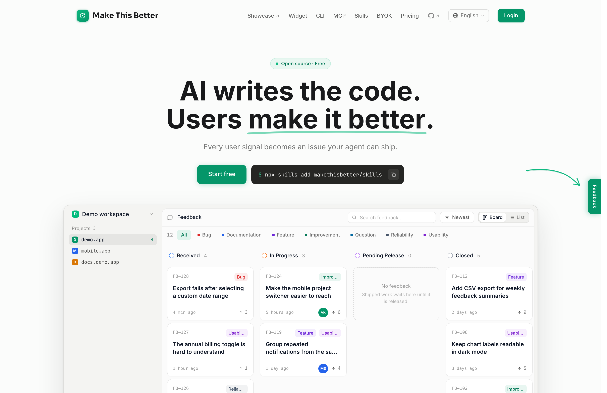

<p align="center">
  
</p>

<h1 align="center">Make This Better</h1>

<p align="center">
  Feedback widget with screenshots, annotations, and AI triage.
</p>

<p align="center">
  <a href="https://makethisbetter.dev">makethisbetter.dev</a>
</p>

<p align="center">
  <a href="https://www.npmjs.com/package/makethisbetter"></a>
  <a href="https://www.npmjs.com/package/makethisbetter"></a>
  <a href="https://bundlephobia.com/package/makethisbetter"></a>
  <a href="https://github.com/makethisbetter/makethisbetter-js/blob/main/LICENSE"></a>
</p>

<p align="center">
  <a href="https://makethisbetter.dev"></a>
</p>

---

## Why

You ship with AI agents. Your users hit bugs you never see in dev. They leave. You never find out why.

This widget gives your users a way to report exactly what went wrong — annotated screenshot, console errors, DOM state, browser info — in two clicks. AI triage turns that into a structured task your coding agent (Claude Code, Cursor, Codex) picks up automatically. The agent ships the fix. The user gets notified.

No more "can you describe what happened?" No more lost screenshots in Slack. The full loop, from frustrated user to shipped fix, runs without you context-switching.

## Quick Start

### CDN (2 lines)

```html
<script src="https://unpkg.com/makethisbetter@1"></script>
<script>
  MakeThisBetter.init({ projectKey: 'mtb_proj_YOUR_KEY' })
</script>
```

### npm

```bash
npm install makethisbetter
```

```js
import { MakeThisBetter } from 'makethisbetter'

MakeThisBetter.init({ projectKey: 'mtb_proj_YOUR_KEY' })
```

That's it. A feedback tab appears on your page.

## How It Works

```
User clicks feedback tab
  -> Annotates the problem (click to pin, drag to draw)
  -> Adds a comment
  -> Submits
     +-- Screenshot captured automatically
     +-- Console errors collected
     +-- Page context assembled (URL, browser, OS, selectors)
     +-- Sent to Make This Better API
     +-- AI asks a clarifying question if needed
  -> Dashboard shows structured feedback
  -> AI triage produces an agent-ready task
  -> Your coding agent picks it up and ships the fix
  -> User gets notified: the fix is live
```

## Framework Guides

<details>
<summary><strong>React / Next.js</strong></summary>

```tsx
// app/providers.tsx (App Router) or pages/_app.tsx (Pages Router)
'use client'
import { useEffect } from 'react'

export function FeedbackProvider({ user }: { user?: { id: string, email?: string } }) {
  useEffect(() => {
    import('makethisbetter').then(({ MakeThisBetter }) => {
      MakeThisBetter.init({
        projectKey: process.env.NEXT_PUBLIC_MTB_KEY!,
        user
      })
    })
    return () => {
      import('makethisbetter').then(({ MakeThisBetter }) => MakeThisBetter.destroy())
    }
  }, [user])
  return null
}
```

</details>

<details>
<summary><strong>Vue / Nuxt</strong></summary>

```ts
// plugins/makethisbetter.client.ts (Nuxt) or main.ts (Vue)
import { MakeThisBetter } from 'makethisbetter'

export default defineNuxtPlugin(() => {
  MakeThisBetter.init({
    projectKey: useRuntimeConfig().public.mtbKey,
  })

  return {
    provide: { mtbDestroy: () => MakeThisBetter.destroy() }
  }
})
```

</details>

<details>
<summary><strong>Astro</strong></summary>

```astro
<!-- src/components/Feedback.astro -->
<script>
  import { MakeThisBetter } from 'makethisbetter'
  MakeThisBetter.init({ projectKey: import.meta.env.PUBLIC_MTB_KEY })
</script>
```

</details>

<details>
<summary><strong>Rails</strong></summary>

```erb
<%# app/views/layouts/application.html.erb %>
<body>
  <%= yield %>

  <%# Turbo replaces <body> on every visit, taking any script-appended element
      with it. Render the host yourself and mark it permanent, or the widget is
      rebuilt after each navigation and anything mid-flight — a half-written
      report, a screen recording — is lost. %>
  <div id="mtb-widget-host" data-turbo-permanent></div>

  <% if current_user&.admin? %>
    <script src="https://unpkg.com/makethisbetter@1"></script>
    <script>
      MakeThisBetter.init({
        projectKey: '<%= Rails.application.credentials.mtb_project_key %>',
        user: { id: '<%= current_user.id %>', email: '<%= current_user.email %>' }
      })
    </script>
  <% end %>
</body>
```

The host must sit inside `<body>` — Turbo pairs permanent elements by id within
the body snapshot, so one placed in `<head>` is never matched and nothing
happens. It needs both the `id` and the attribute; either alone does nothing.

Only Turbo-driven apps need this. React, Vue and Svelte routers re-render inside
their own container and never replace `<body>`, so the host survives on its own.

</details>

<details>
<summary><strong>Plain HTML / Static Sites</strong></summary>

```html
<script src="https://unpkg.com/makethisbetter@1"></script>
<script>
  MakeThisBetter.init({ projectKey: 'mtb_proj_YOUR_KEY' })
</script>
```

</details>

## Features

### Annotation

Click any element to pin it, or drag to draw a freeform highlight. The SDK captures the element's CSS selector, text content, and position.

### Interaction Replay

Switch to **Replay** mode in the toolbar to capture an Interaction Replay (up to 60 seconds). It records rrweb DOM mutations and interaction events. It does not capture screen video or audio and does not request browser media permissions. The recorder loads lazily, so there is zero cost until the reporter starts a replay.

**What a replay contains**

| Captured | Not captured |
|----------|--------------|
| The page's DOM structure and every mutation to it | Passwords, payment-card data, OTPs, access tokens, private keys, and other high-confidence credentials — replaced with `[Filtered]` |
| Visible text content and ordinary form values | Content inside an element you mark `rr-block` or `rr-mask` |
| Mouse positions, clicks, scrolls, viewport size | Screen video, audio, camera, microphone |
| Stylesheets needed to render the replay | Cookies, `localStorage`, HTTP request or response bodies |

Sensitive-data filtering is fixed and cannot be disabled through SDK configuration. Ordinary values such as search queries, issue descriptions, and internal form fields remain available because they are often necessary to reproduce a problem.

**Excluding an element.** Add rrweb's privacy classes to any page region that the SDK must not capture. These classes apply consistently to Interaction Replay, click and input breadcrumbs, annotation metadata, and screenshots:

- `class="rr-block"` — hides the entire marked region while preserving its footprint.
- `class="rr-mask"` — hides text and form-control content while preserving the surrounding layout.

```html
<div class="rr-block"><!-- never appears in a replay --></div>
<span class="rr-mask">Account balance: $12,400</span>
```

If screenshot or Replay filtering cannot complete, that attachment is silently omitted and the text feedback still submits. Automated filtering cannot identify every site-specific secret, so use `rr-block` or `rr-mask` on sensitive application regions.

For screenshots, images that the page can already read remain on their original
URL. If a public cross-origin raster image omits CORS headers, the SDK retries
that image through the MakeThisBetter API. The proxy sends no browser cookies or
authorization headers. Images that require a signed-in session, resolve to a
private network, use an unsupported format such as SVG, exceed the proxy limit,
or fail to load are replaced with a transparent placeholder; the rest of the
screenshot is preserved.

### Frustration Detection

The SDK watches for signals that a user is struggling and proactively offers to collect feedback:

| Signal | Trigger |
|--------|---------|
| Rage click | 4+ clicks on the same interaction target within 1.5 seconds |
| Interaction error | Uncaught error within 2 seconds after an interaction |
| Dead click (DOM) | Command-style control with no response after 1 second |
| Rapid navigation | 3+ browser back/forward navigations within 5 seconds |
| Form failure | The same form fails validation twice within 30 seconds |
| Error page | Landing on a 404/500 error page |

Disable with `frustrationDetection: false`.

### AI Clarification

Before submission, an AI assistant may ask one short follow-up question to clarify the real need — avoiding [XY problems](https://xyproblem.info/) where users describe their attempted solution instead of the actual problem. Once the exchange is complete, the widget submits the feedback automatically.

### Auto-Collected Context

Every submission automatically includes:

- Page URL origin and pathname, browser, OS, screen resolution
- Error type, script pathname, and line/column location (via `window.onerror` and `window.onunhandledrejection`)
- Target element selector and text
- Annotated screenshot with privacy covers applied before upload (via `html-to-image`)
- Annotation coordinates and draw paths

### Internationalization

Built-in support for 7 languages:

| Code | Language |
|------|----------|
| `en` | English (default) |
| `zh-CN` | Chinese (Simplified) |
| `ja` | Japanese |
| `ko` | Korean |
| `es` | Spanish |
| `fr` | French |
| `de` | German |

## Configuration

```js
MakeThisBetter.init({
  // Required
  projectKey: 'mtb_proj_xxx',

  // Optional
  locale: 'en',              // UI language. Unset: falls back to <html lang>, then 'en'
  position: 'right',         // Tab position: 'left' | 'right'
  tabText: 'Feedback',       // Label on the docked tab. Unset: the locale's own wording
  brandColors: {             // Optional semantic colors for the complete Widget
    primary: '#2563eb',
    hover: '#1d4ed8',
    active: '#1e40af',
    onPrimary: '#ffffff',
  },
  entryMode: 'button',       // 'button' docks a tab | 'api' renders none
  theme: 'auto',             // 'light' | 'dark' | 'auto'
  frustrationDetection: true, // Proactive frustration prompts
  apiUrl: 'https://...',     // Self-hosted API endpoint

  // User identification (recommended).
  // Ignored entirely when a valid userToken/userTokenFn JWT is present —
  // see Identity Verification below.
  user: {
    id: 'usr_123',
    email: 'alex@example.com',
    name: 'Alex Chen',
  },
})
```

### Widget branding

Use `brandColors` to apply your product's semantic colors across the launcher,
annotation tools, focus and selection states, calls to action, Reporter bubbles,
and AI decoration. Supply all four values as six-digit hex colors. The SDK uses
them exactly as provided and does not generate a color scale.

```js
MakeThisBetter.init({
  projectKey: 'mtb_proj_xxx',
  tabText: 'Report a problem',
  brandColors: {
    primary: '#2563eb',
    hover: '#1d4ed8',
    active: '#1e40af',
    onPrimary: '#ffffff',
  },
})
```

Success, error, warning, and recording colors keep their state meanings. An
incomplete group or any value that is not `#RRGGBB` rejects the complete group
and leaves the default Widget colors in place.

The `/makethisbetter setup` skill recommends `brandColors` only when it finds a
complete semantic group in your design system; it never guesses missing shades.

`locale` is resolved once, in this order: the `locale` you pass, then the page's
`<html lang>` attribute, then `en`. A tag with no exact match is retried without
its region (`fr-CA` → `fr`), and anything still unmatched falls back to `en`.

### Changing the language at runtime

`MakeThisBetter.setLocale('zh-CN')` switches the language for the tab and for
anything opened afterwards. A popup that is already on screen keeps the language it
was opened in, so a reporter is never re-rendered mid-sentence. Call it before the
reporter opens the widget — for example, in the same place your app applies a
language change.

```js
MakeThisBetter.setLocale('zh-CN')
```

### Identity Verification

Identity verification links feedback to authenticated users and lets them view their own submissions on the feedback board.

**Level 0 -- Anonymous** (default): No user token. Feedback is anonymous.

```js
MakeThisBetter.init({ projectKey: 'mtb_proj_xxx' })
```

Anonymous reporters are offered a follow-up: the success card shows an optional
email field, and an address entered there is sent to the reporter endpoint and
kept in `localStorage` under `mtb_reporter_email` so the field is not asked for
again on later reports from the same browser. The field is skipped entirely when
`user` is set or when a JWT already identifies the reporter. Clearing site data
clears it.

**Level 1 -- Static token**: Pass a pre-generated JWT. Simple, but the token may expire during long sessions.

```js
MakeThisBetter.init({
  projectKey: 'mtb_proj_xxx',
  userToken: 'eyJhbGciOiJIUzI1NiIs...',
})
```

**Level 2 -- Dynamic token (recommended)**: Pass an async function that returns a fresh JWT. The SDK calls it before each API request, so tokens never go stale.

```js
MakeThisBetter.init({
  projectKey: 'mtb_proj_xxx',
  userTokenFn: async () => {
    const res = await fetch('/api/mtb-token')
    const { token } = await res.json()
    return token
  },
})
```

When `userToken` or `userTokenFn` is set, the widget sends an `X-User-Token` header with every request. After a successful submission, a "View my feedback" link appears that opens the project board filtered to the user's submissions.

**The JWT wins over `user`.** These are not two independent ways to name the
reporter. Whenever the server receives a valid token, it takes the reporter's id,
email and name from the token's `sub`, `email` and `name` claims and discards the
`user` fields the widget sent alongside them — a claim you leave out is simply not
recorded, even if `user` carried it. Put everything you want attributed in the
token, and treat `user` as the anonymous-only path.

Generate tokens server-side using your project's Signing Secret (available in your project settings):

```ruby
# Rails example
payload = {
  sub: current_user.id,
  email: current_user.email,
  name: current_user.name,
  exp: 1.hour.from_now.to_i,
}
JWT.encode(payload, project.signing_secret, 'HS256')
```

### Conditional Loading

```js
// Only show to beta users
if (user.isBetaTester) {
  MakeThisBetter.init({ projectKey: 'mtb_proj_xxx', user: { id: user.id } })
}
```

## Self-Hosting

The Widget works with any backend — not just makethisbetter.dev. Implement the
Submission Session profile you need from the
[Self-Hosting API Specification](https://github.com/makethisbetter/makethisbetter-js/blob/main/SELF_HOSTING.md),
then point `apiUrl` at your API version root:

```js
MakeThisBetter.init({
  projectKey: 'your-key',
  apiUrl: 'https://feedback.yoursite.com/api/v1',
})
```

The minimum backend supports the Submission Session flow: create a Session with
multipart context, optionally clarify it with the in-memory Submission Token,
then explicitly finalize or abandon it. The Widget takes care of annotation,
Interaction Replay, frustration detection, and context collection. Anonymous
board handoff and post-submit email capture use two additional optional
operations documented in the specification.

The cloud platform at [makethisbetter.dev](https://makethisbetter.dev) adds AI triage, dashboard, GitHub/Linear sync, and email notifications on top.

## Content Security Policy

If your site sends a `Content-Security-Policy` header, three directives can
affect the widget.

**`script-src`.** The npm build ships inside your own bundle and needs no entry
of its own. The CDN build loads from unpkg:

```
script-src https://unpkg.com;
```

Interaction Replay loads the rrweb recorder on demand. The SDK first tries a
dynamic `import('@rrweb/record')` — when your bundler resolved that dependency,
the recorder is part of your own assets and nothing changes. When that import
is unavailable (the CDN build, or a bundler that externalized it), the SDK
injects a version-pinned, SRI-checked script from jsDelivr:

```
script-src https://cdn.jsdelivr.net;
```

The injected tag carries a `sha384` `integrity` attribute and
`crossorigin="anonymous"`, so the browser refuses to run the file if the CDN
content ever changes; the exact hash is pinned in the source next to the URL.
Because the tag is created by script, adding that hash to `script-src` does not
allowlist it — either allow the `cdn.jsdelivr.net` host, or use
`'strict-dynamic'` with a nonce on the widget's own script tag so trust
propagates to scripts it creates.

**When `script-src` blocks the recorder**, nothing on your page breaks: the
replay cannot start, the SDK logs
`[MakeThisBetter] Interaction replay unavailable, falling back to markup`, and
the toolbar switches back to Markup mode. Annotation, screenshots, and text
feedback are unaffected.

**`connect-src`.** Submissions go to `https://makethisbetter.dev` by default,
or to the origin of your `apiUrl` when self-hosting:

```
connect-src https://makethisbetter.dev;
```

**`style-src`.** The widget injects one `<style>` element into its own shadow
root and never touches your page's stylesheets. Browsers still evaluate the
page's CSP for elements inside a shadow root, so a `style-src` that forbids
`'unsafe-inline'` can leave the widget unstyled. Browser behavior inside shadow
roots has varied between engines and versions — if you run a strict
`style-src`, open the widget once and check.

### Avoiding the rrweb CDN entirely

An allowlist that cannot add jsDelivr can serve the recorder from its own
origin instead. Before injecting the CDN script, the loader checks for an
existing `window.rrwebRecord` global and uses it as-is:

```bash
curl -o public/vendor/rrweb-record.min.js \
  https://cdn.jsdelivr.net/npm/@rrweb/record@2.1.0/umd/record.min.js
```

```html
<script src="/vendor/rrweb-record.min.js"></script>
<script src="https://unpkg.com/makethisbetter@1"></script>
<script>
  MakeThisBetter.init({ projectKey: 'mtb_proj_YOUR_KEY' })
</script>
```

No SDK configuration is needed — the pre-loaded global wins and the CDN is
never contacted. Keep the file at the version the SDK pins
(`@rrweb/record@2.1.0`), because the replay privacy filter is written against
that recorder's event shape.

## Iframes

The widget scopes itself to the document it was initialized in: it positions
against that frame's viewport and reports that frame's URL, DOM, and
interactions. Install it in the frame whose UI you want feedback on. Capturing
across frame boundaries — a parent page recording an embedded iframe, or the
reverse — is not supported.

## API

```ts
import { MakeThisBetter } from 'makethisbetter'

// Start the widget
MakeThisBetter.init(config: MakeThisBetterConfig): void

// Remove the widget and clean up all listeners
MakeThisBetter.destroy(): void

// Open annotation mode from your own UI. Idempotent while already open.
MakeThisBetter.open(): void

// Close annotation mode and restore the page
MakeThisBetter.close(): void

// Show or remove the docked tab on non-touch devices without tearing down
MakeThisBetter.showLauncher(): void
MakeThisBetter.hideLauncher(): void

// Switch the UI language for anything opened afterwards
MakeThisBetter.setLocale(locale: string): void
```

### Your own entry point

A tab docked to the edge of the screen is the right default, but it is not
always right — a full-screen editor, a map, or a phone where every pixel is
spoken for. Set `entryMode: 'api'` to render no tab at all and open the widget
from wherever the entry point belongs in your product:

```js
MakeThisBetter.init({ projectKey: 'mtb_proj_xxx', entryMode: 'api' })

document.querySelector('#menu-feedback')
  .addEventListener('click', () => MakeThisBetter.open())
```

In `api` mode nothing is reachable until you wire up that call, so the widget
logs a warning on init as a reminder. On non-touch devices, `showLauncher()` can
bring the docked tab back at runtime. Touch devices never render the SDK tab;
put the entry in your own mobile UI and call `MakeThisBetter.open()` from it.

## Architecture

The widget runs inside a Shadow DOM container, isolating its styles from your page. No CSS conflicts, no z-index wars.

```
Shadow DOM Host (#mtb-widget-host)
+-- Feedback Tab (entry point)
+-- Annotation Toolbar (Mark up / Replay toggle)
+-- Annotation Session (pin + draw overlays)
+-- Chat Card (description, AI follow-up conversation, success receipt)
+-- Frustration Prompt (proactive trigger)
```

## Bundle Size

| Format | Size | gzip |
|--------|------|------|
| IIFE (`makethisbetter.js`) | ~171 KB | ~49 KB |
| ESM (`makethisbetter.esm.js`) | ~192 KB | ~51 KB |
| CJS (`makethisbetter.cjs`) | ~157 KB | ~44 KB |
| Screenshot chunk (`html-to-image.js` / `.cjs`) | ~18 KB / ~14 KB | ~6 KB / ~5 KB |
| Standalone ESM (`makethisbetter.standalone.js`) | ~210 KB | ~57 KB |

The ESM and CJS bundles load the screenshot renderer (html-to-image) on demand
from the sibling chunk the first time a capture path warms up, so sessions that
never open the widget skip its weight; bundlers split it into the consumer's
own chunks the same way. The IIFE bundle keeps it inlined — classic-script
pages get exactly one file, and its size includes the renderer.

Copying a single file out of `dist/` by path — Rails importmap downloads,
self-hosting, vendoring into a repo — must use the standalone ESM build
(`dist/makethisbetter.standalone.js`, also exported as
`makethisbetter/standalone`): it inlines the screenshot chunk so it survives
being served under a digested or relocated filename. Vendoring the split ESM
file alone leaves its relative `./html-to-image.js` import unresolvable and
screenshot capture silently degrades to text-only feedback. The rrweb recorder (~78 KB) is loaded on demand when
Interaction Replay starts and is not included in these numbers.

## Development

```bash
git clone https://github.com/makethisbetter/makethisbetter-js.git
cd makethisbetter-js
npm install
npm run dev          # Dev server at localhost:5173
npm run build        # Build all formats to dist/
npm test             # Run tests
npm run type-check   # TypeScript validation
```

## Related

| Package | What it does |
|---------|-------------|
| [Make This Better](https://makethisbetter.dev) | The platform — dashboard, AI triage, feedback board |
| [@makethisbetter/mcp](https://github.com/makethisbetter/mcp) | MCP server — your coding agent reads feedback directly |
| [makethisbetter CLI](https://github.com/makethisbetter/cli) | Terminal tool for managing feedback |
| [makethisbetter Skills](https://github.com/makethisbetter/skills) | Claude Code skills — `/makethisbetter` in your editor |

## License

[MIT](LICENSE)

---

<details>
<summary><strong>GitHub repo settings</strong></summary>

- **Description**: Drop-in widget for AI-powered user feedback and automated fixes
- **Homepage**: https://makethisbetter.dev
- **Topics**: feedback, widget, ai, mcp, claude-code, cursor, vibe-coding

</details>
